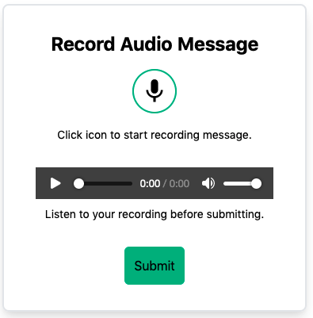

# vue-audio-tapir

Audio recorder component for Vue.js 3. It enables to record, play and send audio messages to a server.


## Use Case

The most popular use case of vue-audio-tapir is to deliver an
audio contact message directly from a website.

## UI



## Example Usage

```html
<meta charset="utf-8">
<title>Vue-audio-tapir Demo</title>
<script src="https://unpkg.com/vue@next/dist/vue.global.prod.js"></script>
<script src="./vue-audio-tapir.umd.js"></script>

<link rel="stylesheet" href="./vue-audio-tapir.css">

<div id="app" style="margin-top: 60px">
  <vue-audio-tapir backendEndpoint="https://yourendpoint/audio" :time="2" ></vue-audio-tapir>
</div>

<script>
app = Vue.createApp({});
app.component('vue-audio-tapir', window['vue-audio-tapir'])
app.mount('#app');
</script>
```

## Properties

| Name             |  Type    | Description                                       | 
|------------------|----------|---------------------------------------------------|
| time             | Number   | Maximum recording time in minutes                 |
| bitRate          | Number   | bit rate of recording                             |
| sampleRate       | Number   | sample rate of recording                          |
| backendEndpoint  | String   | URL of the service that receives the data as POST |
| afterRecording   | Function | callback function when recording is finished.     |
| successfulUpload | Function | callback function that is called when data is uploaded successfully |
| failedUpload     | Function | callback function that is called when upload failed. |

The data sent to the server is encoded in the MP3 format for efficient storage.
For MP3 encoding the [lamejs](https://github.com/zhuker/lamejs) library is used.

## Project Setup

```
npm install
```

### Development
```
npm run serve
```

### Production
```
npm run build
```

### Linting
```
npm run lint
```

## Dependencies

- [Vue 3](https://v3.vuejs.org/)
- [Tailwindcss](https://tailwindcss.com/)
- [lamejs](https://github.com/zhuker/lamejs)

## References

This project has been inspired by [vue-audio-recorder](https://github.com/grishkovelli/vue-audio-recorder)
by Gennady Grishkovtsov.

## License

MIT License
